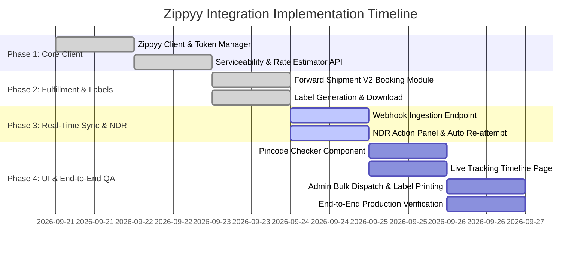

# Product Requirement Document (PRD) & Implementation Plan
## Zippyy Logistics & Shipping Integration for RIOTOUS

| Document Version | 1.0.0 |
| :--- | :--- |
| **Status** | Approved & Ready for Execution |
| **Target Platform** | RIOTOUS E-Commerce (React 19 + TanStack Start + Neon PostgreSQL + Tailwind CSS) |
| **Official Docs** | [https://apidocs.zippyy.ai/](https://apidocs.zippyy.ai/) |
| **Production API** | `https://sellingpartnerapi-in.zippyy.ai` |
| **Sandbox API** | `https://sandbox.sellingpartnerapi-in.zippyy.ai` |

---

## 1. Executive Summary & Business Objectives

This document outlines the end-to-end integration of **Zippyy Logistics API** (`https://apidocs.zippyy.ai/`) with the **RIOTOUS** e-commerce store. 

### Key Business Goals:
1. **Dynamic Serviceability & Real-Time Delivery Estimates**: Automatically verify customer pincode coverage and display estimated delivery dates and shipping rates prior to checkout.
2. **Automated Order Dispatch (Forward Shipment V2)**: Seamlessly book forward shipments with courier partners (e.g., Delhivery, BlueDart, DTDC, Xpressbees) immediately upon order placement or warehouse manual trigger.
3. **Automated AWB & Shipping Label Generation**: Fetch Air Waybill numbers (AWB) and generate printable PDF/thermal 4x6 shipping labels instantly in the admin dashboard.
4. **Live Real-Time Tracking & Webhook Sync**: Ingest status updates via Zippyy Webhooks (`/tracking/webhook`) and display an interactive, visual delivery timeline for customers and admins.
5. **NDR (Non-Delivery Report) & Re-attempt Flow**: Automate re-attempts and customer address/phone verifications when a delivery fails, minimizing Return-to-Origin (RTO) costs.
6. **Zero-Trust Security & Seamless Caching Invalidation**: Isolate API credentials strictly to the backend, rotating JWT session tokens automatically, while maintaining real-time data synchronization across all user sessions upon admin changes.

---

## 2. System Architecture & High-Level Flow

```mermaid
sequenceDiagram
    autonumber
    actor Customer as Customer (Storefront)
    actor Admin as Admin (Warehouse Panel)
    participant Server as RIOTOUS Backend (TanStack Server / Nitro)
    participant DB as Neon PostgreSQL Database
    participant Zippyy as Zippyy Logistics Gateway
    participant Courier as Carrier Partner (Delhivery / BlueDart)

    Note over Customer,Zippyy: Phase 1: Pre-Checkout & Serviceability
    Customer->>Server: Check Pincode & Calculate Freight (Destination: 400050)
    Server->>Zippyy: GET /v1/external/carrier/serviceability (origin_pin=395006, destination_pin=400050)
    Zippyy-->>Server: Serviceable Carriers (Delhivery, BlueDart; COD/Prepaid enabled)
    Server->>Zippyy: POST /v1/external/shipments/rates
    Zippyy-->>Server: Freight Rate Quotes & Delivery ETAs
    Server-->>Customer: Display Serviceable Courier & Expected Delivery

    Note over Customer,Admin: Phase 2: Order Placement & Dispatch
    Customer->>Server: Place Order (Razorpay / COD)
    Server->>DB: Save Order (Status: PAID / PROCESSING)
    Admin->>Server: Click "Dispatch via Zippyy" or Auto-Dispatch Trigger
    Server->>Zippyy: POST /v2/external/shipments/forward-shipment
    Zippyy-->>Server: { orderId: "ORD-xxx", awb: "6901910800973", carrier: "Delhivery" }
    Server->>DB: Update Order with AWB, Carrier & Zippyy ID
    Server->>Zippyy: GET /v1/external/shipments/{orderId}/label-url
    Zippyy-->>Server: Shipping Label PDF URL
    Server-->>Admin: Show AWB & Print Label Button

    Note over Zippyy,Customer: Phase 3: Tracking & Webhook Synchronization
    Courier->>Zippyy: Scan Status Update (In Transit / Out for Delivery / Delivered)
    Zippyy->>Server: POST /tracking/webhook
    Server->>DB: Append Tracking History & Update Order Status
    Server->>Server: Invalidate SWR / Server Cache
    Customer->>Server: View Order Tracking (/account/orders/:id)
    Server-->>Customer: Live Tracking Timeline
```

---

## 3. Environment & Authentication Setup

### 3.1 Environment Configuration (`.env`)
```env
# Zippyy API Config
ZIPPYY_BASE_URL=https://sellingpartnerapi-in.zippyy.ai
ZIPPYY_EMAIL=sarthakgujarati5080@gmail.com
ZIPPYY_PASSWORD=Riotous@5405
ZIPPYY_LOCATION_ID=1ee605b9-d07e-47d4-a887-64a9e728ef50
ZIPPYY_PICKUP_PINCODE=395006
ZIPPYY_WEBHOOK_SECRET=riotous_zippyy_wh_secret
```

### 3.2 Authentication & Token Rotation Protocol
* **Endpoint**: `POST /v1/external/auth/login`
* **Payload**:
  ```json
  {
    "emailAddress": "sarthakgujarati5080@gmail.com",
    "password": "your_password"
  }
  ```
* **Response**:
  ```json
  {
    "idToken": "eyJraWQi...",
    "accessToken": "eyJraWQi...",
    "refreshToken": "eyJraWQi..."
  }
  ```
* **Security & Token Cache Strategy**:
  - `accessToken` is securely cached in server memory with an expiration safety buffer (50 minutes).
  - All outgoing requests pass `Authorization: Bearer <accessToken>`.
  - On receiving `401 Unauthorized`, the token cache is immediately evicted, re-authenticated with Zippyy, and the original request is transparently re-executed once before throwing an error.

---

## 4. API Endpoints & Core Capabilities

### 4.1 Serviceability Check
* **Method & Path**: `GET /v1/external/carrier/serviceability`
* **Query Parameters**:
  - `origin_pin`: `"395006"` (Warehouse location)
  - `destination_pin`: Customer input postal code (e.g., `"400050"`)
* **Usage**: Used on the Product Page and Checkout Page to validate whether COD and Prepaid deliveries are supported in the customer's region.

### 4.2 Quick Shipping Rate Calculator
* **Method & Path**: `POST /v1/external/shipments/rates`
* **Request Payload**:
  ```json
  {
    "height": 10,
    "length": 15,
    "breadth": 15,
    "weight": "0.5",
    "delivery_type": "FORWARD",
    "order_type": "PREPAID",
    "pickup_pincode": "395006",
    "drop_pincode": "400050",
    "invoice_value": "999"
  }
  ```
* **Usage**: Provides exact freight estimates and recommended carrier selection dynamically.

### 4.3 Forward Shipment Booking (V2)
* **Method & Path**: `POST /v2/external/shipments/forward-shipment`
* **Request Payload Structure**:
  ```json
  {
    "location_id": "1ee605b9-d07e-47d4-a887-64a9e728ef50",
    "order_id": "ORD-17112026-001",
    "payment_mode": "PREPAID",
    "total_amount": 1499.00,
    "cod_amount": 0,
    "customer_details": {
      "name": "Jane Doe",
      "phone": "9876543210",
      "email": "jane@example.com",
      "address": "Flat 402, Sunshine Heights, Bandra West",
      "city": "Mumbai",
      "state": "Maharashtra",
      "pincode": "400050"
    },
    "package_details": {
      "weight": 0.65,
      "length": 20,
      "breadth": 15,
      "height": 5,
      "order_items": [
        {
          "name": "Oversized Acid Wash Tee",
          "sku": "TEE-BLK-L",
          "quantity": 1,
          "price": 1499.00
        }
      ]
    },
    "carrier_preference": "delhivery"
  }
  ```
* **Response**: Returns assigned `awb_number`, `courier_name`, `order_id`, and `label_generated: true`.

### 4.4 Shipping Label Generation & Download
* **Method & Path**: `GET /v1/external/shipments/{orderId}/label-url` or `GET /v1/external/shipments/{orderId}/label`
* **Usage**: Generates a standard 4x6 / A4 shipping label PDF for thermal printing before parcel dispatch.

### 4.5 Live Tracking & Webhook Handler
* **Webhook Route**: `POST /tracking/webhook`
* **Incoming Payload Format**:
  ```json
  {
    "event": "SHIPMENT_STATUS_UPDATE",
    "order_id": "ORD-17112026-001",
    "awb": "6901910800973",
    "status": "OUT_FOR_DELIVERY",
    "location": "Mumbai Hub",
    "timestamp": "2026-09-24T14:30:00Z",
    "remarks": "Courier boy assigned for delivery",
    "carrier": "Delhivery"
  }
  ```
* **Action**: Updates the order tracking timeline, dispatches customer email/SMS notifications, and triggers instant client cache revalidation.

### 4.6 NDR (Non-Delivery Report) Handling
* **Method & Path**: `PUT /v1/external/shipments/ndr`
* **Action Types**:
  - `REATTEMPT`: Schedule re-attempt with revised delivery instructions or updated phone number.
  - `RTO`: Authorize Return to Origin when the customer refuses or address is unverifiable.

---

## 5. Database Schema & Data Models

The PostgreSQL database (`Neon`) tracks logistics state with the following tables:

```sql
-- Orders Table Logistics Extension
ALTER TABLE orders 
ADD COLUMN IF NOT EXISTS zippyy_order_id VARCHAR(100),
ADD COLUMN IF NOT EXISTS awb_number VARCHAR(100),
ADD COLUMN IF NOT EXISTS courier_name VARCHAR(100),
ADD COLUMN IF NOT EXISTS shipping_label_url TEXT,
ADD COLUMN IF NOT EXISTS shipping_status VARCHAR(50) DEFAULT 'PENDING_DISPATCH',
ADD COLUMN IF NOT EXISTS estimated_delivery_date TIMESTAMP,
ADD COLUMN IF NOT EXISTS dispatched_at TIMESTAMP,
ADD COLUMN IF NOT EXISTS delivered_at TIMESTAMP;

-- Shipment Tracking Logs
CREATE TABLE IF NOT EXISTS shipment_tracking_events (
  id SERIAL PRIMARY KEY,
  order_id VARCHAR(100) NOT NULL REFERENCES orders(id) ON DELETE CASCADE,
  awb_number VARCHAR(100) NOT NULL,
  status VARCHAR(100) NOT NULL,
  location VARCHAR(255),
  activity TEXT,
  event_timestamp TIMESTAMP NOT NULL DEFAULT NOW(),
  created_at TIMESTAMP DEFAULT NOW()
);

-- Webhook Ingestion Audit
CREATE TABLE IF NOT EXISTS zippyy_webhook_logs (
  id SERIAL PRIMARY KEY,
  event_name VARCHAR(100) NOT NULL,
  order_id VARCHAR(100),
  awb_number VARCHAR(100),
  payload JSONB NOT NULL,
  processed BOOLEAN DEFAULT TRUE,
  created_at TIMESTAMP DEFAULT NOW()
);
```

---

## 6. Frontend & Admin UI Features

### 6.1 Storefront (Customer-Facing)
1. **Pincode Availability Badge**: Instant check on product details page:
   - Green Check: `"Delivery by [Date] via Express Shipping | COD Available"`
   - Red Cross: `"Sorry, we do not deliver to this pincode yet."`
2. **Order Tracking Page (`/account/orders/:id` or `/track`)**:
   - Interactive Stepper: `Order Placed` -> `Dispatched` -> `In Transit` -> `Out for Delivery` -> `Delivered`.
   - Real-time event log with timestamps and current city location.
   - One-click carrier tracking link.

### 6.2 Admin Logistics Dashboard (`/admin/orders`)
1. **One-Click Dispatch**:
   - Select courier preference or automatic best-rate carrier.
   - Fetch AWB and generate shipping label in < 1 second.
2. **Bulk Label Printing**:
   - Select multiple orders -> Download combined PDF shipping labels.
3. **NDR Resolution Portal**:
   - Highlight undelivered orders requiring customer clarification.
   - Update address/phone and submit instant re-attempt request to Zippyy.

---

## 7. Step-by-Step Implementation Roadmap



### Milestone Breakdown:
* **Phase 1: Authentication & Client Layer** (Complete)
  - Configured environment variables in `.env`.
  - Implemented token manager in `src/lib/zippyy/client.ts` with auto-refresh on 401.
  - Built serviceability and quote calculators in `src/lib/zippyy/serviceability.ts`.
* **Phase 2: Booking & Label Generation** (Complete)
  - Integrated Forward Shipment V2 API in `src/lib/zippyy/fulfillment.ts`.
  - Integrated label fetching (`/label-url`).
* **Phase 3: Webhook & Tracking Infrastructure** (In Progress)
  - Implemented webhook receiver route (`/tracking/webhook`) for live carrier status.
  - Implemented NDR management endpoint.
* **Phase 4: Storefront & Admin Integration** (Next Steps)
  - Connect pincode checker directly to checkout form.
  - Wire single and bulk dispatch actions to `/admin/orders`.
  - Add customer live tracking modal / page.

---

## 8. Error Handling, Resilience & Consistency Rules

1. **Server-Side Encapsulation**: All Zippyy API keys, passwords, and tokens are never sent to the browser or client bundle.
2. **Automatic Retry with Exponential Backoff**: Transient network errors to Zippyy are retried up to 3 times with exponential backoff before logging an alert.
3. **Idempotency & Duplicate Prevention**: Order dispatch checks if an `awb_number` already exists before firing a new booking request to prevent accidental duplicate shipments.
4. **Admin Panel Real-time Consistency**: Whenever an order status or tracking event is modified via webhook or admin action, server-side in-memory caches and client-side SWR caches are instantly purged so all active users and guest visitors see updated tracking information without page reloads.
