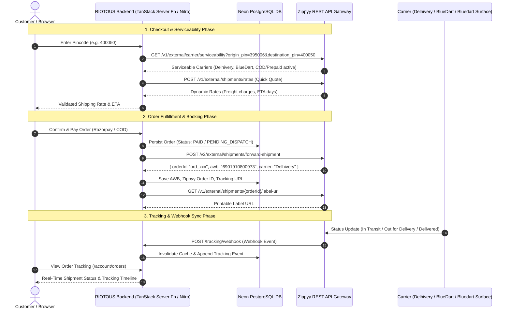

# Product Requirement Document (PRD): Zippyy Logistics & Shipping Integration

| Document Version | 1.0.0 |
| :--- | :--- |
| **Status** | Approved / Ready for Integration |
| **Target Platform** | RIOTOUS E-Commerce (React + TanStack Start + Neon PostgreSQL + Tailwind CSS) |
| **API Documentation Source** | [https://apidocs.zippyy.ai/](https://apidocs.zippyy.ai/) |
| **Environments** | **Production**: `https://sellingpartnerapi-in.zippyy.ai`<br/>**Sandbox**: `https://sandbox.sellingpartnerapi-in.zippyy.ai` |

---

## 1. Executive Summary & Objectives

The purpose of this integration is to seamlessly connect the **RIOTOUS** e-commerce platform with the **Zippyy Logistics & Shipping Partner API** (`https://apidocs.zippyy.ai/`). This end-to-end integration automates:
1. **Dynamic Pincode Serviceability & Real-Time Shipping Quotes** during customer checkout.
2. **Automated & Manual Order Booking (Forward Shipment V2)** upon payment confirmation.
3. **Automated AWB Generation & Instant Shipping Label (PDF/URL) Downloads** for warehouse operations.
4. **Real-time Live Shipment Tracking** with bidirectional Webhook synchronization for customer order portals.
5. **Non-Delivery Report (NDR) Management** allowing automated and admin-driven reattempts or Return to Origin (RTO).
6. **Zero-Trust Token Management** ensuring API keys and credentials are never exposed to the client-side frontend.

---

## 2. High-Level Architecture & Flow



---

## 3. Environment & Authentication Configuration

### 3.1 Environment Variables
All secret keys and credentials must reside on the server environment.

```env
# Zippyy API Credentials
ZIPPYY_BASE_URL=https://sellingpartnerapi-in.zippyy.ai
ZIPPYY_EMAIL=sarthakgujarati5080@gmail.com
ZIPPYY_PASSWORD=Riotous@5405
ZIPPYY_LOCATION_ID=1ee605b9-d07e-47d4-a887-64a9e728ef50
ZIPPYY_PICKUP_PINCODE=395006

# Optional direct API Gateway Header Key (if enabled by Zippyy)
ZIPPYY_API_KEY=
```

### 3.2 Token Lifecycle & Auto-Refresh Policy
1. **Endpoint**: `POST /v1/external/auth/login`
2. **Payload**:
   ```json
   {
     "emailAddress": "sarthakgujarati5080@gmail.com",
     "password": "your_password"
   }
   ```
3. **Response**:
   ```json
   {
     "idToken": "eyJraWQiOi...",
     "accessToken": "eyJraWQiOi...",
     "refreshToken": "eyJraWQiOi..."
   }
   ```
4. **Token Cache & Invalidation**:
   - Access tokens are cached in server memory with an expiration buffer (e.g. 50 minutes).
   - If an API call returns `401 Unauthorized`, the token cache is immediately evicted, a fresh token is acquired, and the request is retried once transparently.
   - All authenticated requests pass the header: `Authorization: Bearer <accessToken>`.

---

## 4. API Endpoints & Data Contracts

### 4.1 Check Courier Serviceability
- **Method**: `GET`
- **Path**: `/v1/external/carrier/serviceability`
- **Query Parameters**:
  - `origin_pin` (string, required): Warehouse pickup postal code (e.g. `395006`).
  - `destination_pin` (string, required): Customer delivery postal code (e.g. `400050`).
- **Response `200 OK`**:
  ```json
  [
    {
      "carrier": "bluedart",
      "zone": "z_d",
      "prepaidActive": true,
      "codActive": true,
      "replacementActive": true,
      "reversePickupActive": true
    },
    {
      "carrier": "Delhivery",
      "zone": "z_c",
      "prepaidActive": true,
      "codActive": true,
      "replacementActive": true,
      "reversePickupActive": true
    }
  ]
  ```

---

### 4.2 Quick Quote / Rate Calculator
- **Method**: `POST`
- **Path**: `/v1/external/shipments/rates`
- **Request Body**:
  ```json
  {
    "height": 10,
    "length": 15,
    "breadth": 15,
    "weight": "0.5",
    "delivery_type": "FORWARD",
    "order_type": "PREPAID",
    "pickup_pincode": "395006",
    "drop_pincode": "400050",
    "invoice_value": "999"
  }
  ```
- **Response `200 OK`**:
  ```json
  {
    "rates": [
      {
        "id": "rate_5c032faea53a4a869b8955533c83078a",
        "carrier": "Delhivery",
        "service": "Express",
        "rate": "129.80",
        "forwardFreightCharges": "129.80",
        "codCharges": "0.00",
        "rtoCharges": "129.80",
        "zone": "C",
        "currency": "INR",
        "est_delivery_days": 3,
        "charged_weight": "1.00"
      }
    ]
  }
  ```

---

### 4.3 Forward Shipment Booking (V2)
- **Method**: `POST`
- **Path**: `/v2/external/shipments/forward-shipment`
- **Request Body**:
  ```json
  {
    "orderNumber": "RIO-ORD-10023",
    "orderCreatedAt": "1760103113424",
    "channelId": "External",
    "warehouseId": "1ee605b9-d07e-47d4-a887-64a9e728ef50",
    "returnAddressId": "1ee605b9-d07e-47d4-a887-64a9e728ef50",
    "receiver": {
      "firstName": "Sarthak",
      "lastName": "Gujarati",
      "email": "customer@example.com",
      "phoneNumber": "9876543210",
      "companyName": ""
    },
    "destination": {
      "addressLine1": "Flat 402, Skyline Towers",
      "addressLine2": "Ring Road",
      "city": "Surat",
      "state": "Gujarat",
      "country": "India",
      "countryCode": "IN",
      "pinCode": "395006",
      "type": "Residential"
    },
    "type": "Zippyy",
    "sellerNote": "RIOTOUS Streetwear - Handle with care",
    "parcelAttributes": {
      "dimension": {
        "length": 30.0,
        "width": 25.0,
        "height": 5.0,
        "unit": "cm"
      },
      "weight": {
        "weight": 0.5,
        "unit": "kg"
      }
    },
    "tags": "Apparel",
    "productRequestsList": [
      {
        "productName": "RIOTOUS Oversized Anime Hoodie",
        "price": 1499.0,
        "quantity": 1,
        "sku": "RIO-HD-BLK-L",
        "taxRate": "0",
        "discount": "0",
        "currencyCode": "INR",
        "taxesIncluded": true
      }
    ],
    "shippingProperties": {
      "orderType": "PREPAID",
      "subTotal": 1499.0,
      "shippingCharges": 0.0,
      "otherCharges": 0.0,
      "discount": 0.0
    },
    "carrier": "Delhivery",
    "service": "Surface"
  }
  ```
- **Response `201 Created`**:
  ```json
  {
    "orderId": "ord_1382903931993b28be97a740140786d4",
    "awb": "6901910800973",
    "cratedAt": "1750079295760",
    "carrier": "Delhivery",
    "service": "Surface",
    "shipmentPurchaseError": null
  }
  ```

---

### 4.4 Shipping Label Generation
- **Label URL**: `GET /v1/external/shipments/{orderId}/label-url`
  - Response: `{ "labelUrl": "https://s3.amazonaws.com/zippyy-labels/ord_xxx.pdf" }`
- **Label Binary (PDF)**: `GET /v1/external/shipments/{orderId}/label-binary`
  - Response: Raw binary PDF payload for direct streaming to thermal barcode printers.

---

### 4.5 Shipment Cancellation
- **Method**: `PUT`
- **Path**: `/v1/external/shipments/{orderId}/cancel`
- **Description**: Cancels a booked shipment with the assigned courier if it has not yet been picked up.

---

### 4.6 Real-Time Tracking & Webhooks
1. **Polling Endpoint**: `GET /v1/external/shipments/track?awb={awb}` or `GET /v1/external/shipments/track?orderId={orderId}`
2. **Webhook Receiver**:
   - **Route**: `POST /tracking/webhook` and `POST /api/zippyy/webhook`
   - **Payload Received from Zippyy**:
     ```json
     {
       "awb": "6901910800973",
       "orderId": "ord_1382903931993b28be97a740140786d4",
       "status": "IN_TRANSIT",
       "statusCode": "IT",
       "location": "Surat Hub",
       "timestamp": "2026-09-23T04:00:00.000Z",
       "remarks": "Shipment arrived at destination hub"
     }
     ```
   - **Processing**:
     - Updates order record in database (`tracking_events`, `shipping_status`).
     - Triggers live cache invalidation so storefront order history instantly updates for the user.
     - Responds immediately with HTTP `200 OK`.

---

### 4.7 Non-Delivery Report (NDR) Management
- **Method**: `PUT`
- **Path**: `/v1/external/shipments/ndr`
- **Request Body**:
  ```json
  {
    "orderId": "ord_1382903931993b28be97a740140786d4",
    "action": "REATTEMPT",
    "nextDeliveryDate": "2026-09-25",
    "remarks": "Customer requested delivery after 3 PM"
  }
  ```
- **Supported Actions**: `REATTEMPT`, `RTO` (Return to Origin).

---

## 5. UI/UX Feature Specifications

### 5.1 Storefront Checkout Flow
1. **Dynamic Postal Code Validator**: When a customer fills their delivery address, a debounced query checks courier serviceability and presents realistic delivery ETAs.
2. **COD vs Prepaid Verification**: If COD is selected, the system checks whether `codActive: true` for that destination postal code.

### 5.2 Admin Fulfillment Dashboard
1. **Orders Table**:
   - Columns: Order #, Customer, Total, Payment, Shipping Status, Carrier, AWB, Actions.
   - Action: **"Dispatch via Zippyy"** button.
   - Quick Actions: **"Download Shipping Label"**, **"Track Live"**, **"Cancel Shipment"**.
2. **Batch Dispatch**: Admin can select multiple paid orders and trigger automated batch dispatch to Zippyy in parallel.
3. **NDR Portal**: Dedicated tab displaying undelivered attempts with one-click **"Request Re-attempt"** or **"Approve RTO"**.

### 5.3 Customer Tracking Page
1. Accessible at `/account/orders` and `/tracking?awb=...`.
2. Interactive visual timeline: `Order Placed` -> `Packed & Shipped` -> `In Transit` -> `Out for Delivery` -> `Delivered`.

---

## 6. Database Schema Requirements

The PostgreSQL schema contains the following fields in the `orders` table:
```sql
ALTER TABLE orders ADD COLUMN IF NOT EXISTS zippyy_order_id TEXT;
ALTER TABLE orders ADD COLUMN IF NOT EXISTS tracking_number TEXT;
ALTER TABLE orders ADD COLUMN IF NOT EXISTS carrier_name TEXT;
ALTER TABLE orders ADD COLUMN IF NOT EXISTS shipping_service TEXT;
ALTER TABLE orders ADD COLUMN IF NOT EXISTS shipping_label_url TEXT;
ALTER TABLE orders ADD COLUMN IF NOT EXISTS shipping_status TEXT DEFAULT 'unfulfilled';
ALTER TABLE orders ADD COLUMN IF NOT EXISTS tracking_history JSONB DEFAULT '[]'::jsonb;
ALTER TABLE orders ADD COLUMN IF NOT EXISTS ndr_status TEXT;
```

---

## 7. Security & Compliance Requirements

1. **Backend-Only Execution**: No Zippyy credentials or direct HTTP calls to `zippyy.ai` are allowed from browser JavaScript.
2. **Rate Limiting & Retries**: All outbound calls implement exponential backoff retry logic (up to 3 retries).
3. **Admin Authorization**: All dispatch and cancellation server functions require verified admin session authentication.
4. **Webhook Idempotency**: Webhook events are deduplicated by `(awb, statusCode, timestamp)` to prevent duplicate event writes.

---

## 8. Verification & Test Plan

| Test Case ID | Feature Area | Test Scenario | Expected Outcome |
| :--- | :--- | :--- | :--- |
| **TC-01** | Auth & Token | Call Zippyy login with configured credentials | Returns valid `accessToken` and caches it |
| **TC-02** | Token Expiry | Expired token simulated during request | Transparently refreshes token and succeeds |
| **TC-03** | Serviceability | Check Pincode `395006` -> `400050` | Returns active carriers list |
| **TC-04** | Rate Quote | Calculate shipping for 0.5kg parcel | Returns estimated freight charges & delivery days |
| **TC-05** | Forward Shipment | Book order with valid receiver & parcel info | Generates `orderId`, `awb`, and assigns courier |
| **TC-06** | Label Generation | Fetch label for booked order | Returns valid PDF download URL |
| **TC-07** | Webhook Sync | Receive tracking update event | Updates order status and tracking history in DB |
| **TC-08** | NDR Action | Trigger reattempt on failed delivery | Updates shipment action with courier |
| **TC-09** | Build Integrity | Run `npm run build` | Zero TypeScript or build compilation errors |

---

## 9. Conclusion

This PRD provides the full functional and technical blueprint for operating Zippyy logistics on the **RIOTOUS** platform. All data models, endpoints, lifecycle flows, and security guidelines are aligned with the official [Zippyy REST API Specification](https://apidocs.zippyy.ai/).
